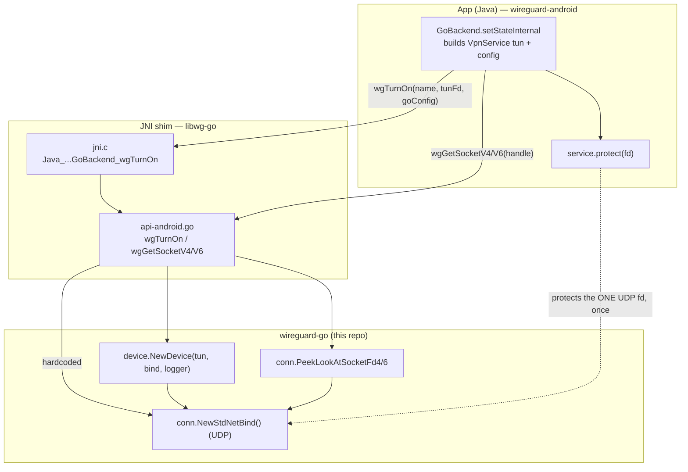

# Android Integration — WebSocket Backend Swap

Companion to `docs/WORK_PLAN.md` (phase **P9**). It records exactly how the official WireGuard Android
app embeds this Go library today, and the concrete changes required to run the **WebSocket transport**
inside it — i.e. to "swap the Go backend" for a build that speaks `ws(s)://`.

All facts below are verified against the checkouts on disk:
- **this repo** — `golang.zx2c4.com/wireguard` (wireguard-go), paths linked.
- **the app** — `../wireguard-android` (sibling checkout), paths given as plain text (outside this workspace).

The changes span **three layers**. Only Layer A is in this repository, and it is **already implemented
and shipped** (v1.0.0); Layers B and C are the user's forks of wireguard-android and are listed so the
interface this repo exposes is unambiguous.

---

## 1. How it works today (verified)

The app builds this library as a C-shared object (`libwg-go`) with a tiny JNI shim, and drives it over
a UAPI settings string.

Key facts:
- **Config path is a single UAPI/userspace string.** Java builds `config.toWgUserspaceString()`
  (`GoBackend.java:294`) and passes it to `wgTurnOn(name, tun.detachFd(), goConfig)`
  (`GoBackend.java:341`); the Go side applies it via `device.IpcSet(settings)`
  (`api-android.go:93`). There are **no env vars or CLI flags** on Android.
- **The bind is hardcoded to UDP.** `device.NewDevice(tun, conn.NewStdNetBind(), logger)`
  (`api-android.go:91`).
- **Socket protection is one-shot, one fd per family.** Java calls
  `service.protect(wgGetSocketV4(handle))` and `…V6` once after turn-on
  (`GoBackend.java:349-350`); those exports return the single UDP socket via
  `bind.PeekLookAtSocketFd4/6()` (`api-android.go:172,189`), which requires the bind to implement
  [`conn.PeekLookAtSocketFd`](../conn/conn.go#L69) (one fd per family).
- **Mobile roaming is pinned.** `DisableSomeRoamingForBrokenMobileSemantics()` (`api-android.go:99`).
- **Endpoints are pre-resolved to IPs** in Java before building the config
  (`GoBackend.java:278`, `InetEndpoint`), and `InetEndpoint.parse` accepts only `host:port`.
- **JNI shim** exports exactly `wgTurnOn/wgTurnOff/wgGetSocketV4/wgGetSocketV6/wgGetConfig/wgVersion`
  (`jni.c`); there is **no** callback/protect-callback infrastructure.

---

## 2. What WebSocket changes — the two cruxes

1. **Per-connection socket protection.** UDP has one fixed socket, protected once. WebSocket is TCP:
   connections are **dialed, dropped, and re-dialed** (every network switch = a new socket). The
   one-shot `wgGetSocketV4/V6` model cannot protect sockets that come and go. Each WS socket must be
   `VpnService.protect()`-ed **at dial time**, so the Go bind must **call back into Java per dial**.
   This is the Android delivery of the same egress-loop prevention that the socket `fwmark` (`SO_MARK`)
   provides on Linux/BSD and `wg-quick` routing provides on darwin — but on an unprivileged app,
   `protect()` is the only sanctioned mechanism, hence a callback rather than `SO_MARK`.

2. **All WS config travels in the UAPI settings string.** Because Android passes only the
   `toWgUserspaceString()` blob and no flags/env, the per-peer `transport`, `endpoint` (`ip:port`),
   `ws_url`, `wstunnel_target`, `ws_bearer`, `ws_mask`, per-peer TLS paths, and the device-level
   `ws_listen`/`ws_server_*` keys are all expressed as **UAPI keys** (`docs/CONFIGURATION.md`). Since
   the transport is now per-peer and env-free, this is the ONLY channel — nothing lives at process
   level anymore.

---

## 3. Changes by layer

### Layer A — wireguard-go (THIS repo; IMPLEMENTED — shipped in v1.0.0)

Everything in this layer already exists in-repo; the symbols below are the contract Layers B/C build on.

- **WS bind constructible programmatically.** Android never runs `main.go`; it calls
  `device.NewDevice(tun, bind, logger)` directly. The WS bind is built the same way via
  `conn.NewMultiplexBind(opts ...conn.WSOption)` (UDP + WebSocket in one bind; per-peer transport), or `conn.NewWebSocketBind` for a WS-only bind.
- **Per-dial protect hook — the one cross-language contract.** The WS client bind accepts a protect
  callback via the `conn.WithWSProtect(func(fd int))` option
  ([conn/ws_config.go](../conn/ws_config.go)) and invokes it inside `net.Dialer.Control` for **every**
  dialed socket, before use (the per-OS `conn/ws_pinning_{mark_unix,darwin,default}.go`). This is the sole
  new cross-language contract Android needs.
- **WS config via UAPI.** The per-peer keys (`transport`, `endpoint=ip:port`, `ws_url`, `wstunnel_target`,
  `ws_bearer`) parse from the settings string in [device/uapi.go](../device/uapi.go), the only channel
  Android has.
- **The WS bind does not implement `conn.PeekLookAtSocketFd`.** With no single persistent socket,
  `wgGetSocketV4/V6` simply return `-1` (harmless); protection goes through the per-dial hook.
- **Pre-resolved `endpoint=ip:port`, dialed directly** ([conn/ws_dial.go](../conn/ws_dial.go)) — the
  socket connects to the resolved `endpoint` ip:port; the per-peer `ws_url` supplies only the TLS SNI,
  the HTTP `Host`, and the upgrade path. DNS resolution happens in the tooling before the config is
  built (like UDP), NOT in the bind.
- **Network-switch bump: nothing new needed in this repo.** `device.BindUpdate()` is exported
  ([device/device.go](../device/device.go)) and the WS bind's `Close`/`Open` implement full
  teardown/re-arm, so a bump = reconnect + re-pin to the pre-resolved endpoint. On the standalone daemon the bump
  is driven by the in-repo OS path monitor `conn.WSPathMonitor` / `conn.NewWSPathMonitor`
  ([conn/ws_pathmonitor.go](../conn/ws_pathmonitor.go); linux netlink, darwin `NWPathMonitor`) — the
  desktop counterpart the Android app reimplements with `ConnectivityManager`. In-process netlink is
  NOT an option on Android: apps targeting API 30+ cannot use an unprivileged `NETLINK_ROUTE` route
  dump, so the network-change signal must come from the app.
- **TLS: system roots by default; CA/mTLS optional over UAPI.** A mobile client typically needs only
  system roots + SNI (from `ws_url`), but CA and mutual-TLS material may be supplied via the per-peer
  `ws_tls_ca` / `ws_tls_cert` / `ws_tls_key` UAPI keys (loaded in [conn/ws_dialcfg.go](../conn/ws_dialcfg.go)).

### Layer B — libwg-go (`../wireguard-android/tunnel/tools/libwg-go`; user's fork)

- **Depend on the WS-capable fork.** Point `go.mod` at the user's wireguard-go fork.
- **Select the bind by config.** In `wgTurnOn` (`api-android.go:76`), replace the hardcoded
  `conn.NewStdNetBind()` (`api-android.go:91`) with logic that picks the WS bind when the config
  indicates the WS transport (parse it from `settings`, or add a `wgTurnOn` parameter). Construct the
  WS bind wired to the protect callback below.
- **Add the protect-callback bridge (Go → Java).** A new export (e.g. `wgSetProtectCallback`, or an
  extra `wgTurnOn` argument) that stores the JVM handle + a Java method reference; the Go protect hook
  calls a C function in `jni.c` that does `AttachCurrentThread` and invokes
  `VpnService.protect(fd)` (see §4). Add the declaration to `jni.c` alongside the existing exports.
- **Add a network-switch bump export.** A `wgBumpSockets`-style export wrapping the already-exported
  `device.BindUpdate()` (mirrors `api-apple.go:176-188` in wireguard-apple), called from the app's
  `ConnectivityManager.NetworkCallback` (WORK_PLAN D19).

### Layer C — app (`../wireguard-android`, Java; user's fork)

- **Config model** — `Config`/`Peer`/`Interface` and `toWgUserspaceString()` must carry and emit the
  per-peer WS keys (`transport`, `endpoint=ip:port`, `ws_url`, and the `ws_*` keys) so they reach
  `wgTurnOn`'s settings (`GoBackend.java:294`). The transport is the per-peer `transport=` key, and the
  `ws_url` (carrying `host:port/path`) is a SEPARATE key from the routable `endpoint`.
- **Resolve the endpoint to `ip:port` up front (like UDP).** The bind dials the fixed `endpoint` and
  uses `ws_url` only for TLS SNI / HTTP Host / upgrade path, so the app resolves the `ws_url` host to an
  `endpoint=ip:port` before building the config (reuse the existing `InetEndpoint` DNS pre-resolution,
  `GoBackend.java:278`) and re-pushes a fresh config when the server address changes — the bind never
  re-resolves DNS itself.
- **Register the protect callback** (JNI) and drop reliance on the one-shot
  `service.protect(wgGetSocketV4/V6(...))` (`GoBackend.java:349-350`) for WS tunnels — those now
  return `-1`. Keep them for the UDP path.
- **Register a `ConnectivityManager.registerNetworkCallback()`** and call the bump export on network
  change — the Android delivery of what the standalone daemon does in-repo with `conn.WSPathMonitor`
  ([conn/ws_pathmonitor.go](../conn/ws_pathmonitor.go)) and what the Apple app does with `NWPathMonitor`.
- **UI** — a way to enter the WS transport, server URL, mode, target, and bearer.

---

## 4. The protect-callback bridge (mechanism)

The only genuinely new plumbing is letting Go ask Java to `protect()` a freshly created socket fd.
Pattern:

1. **Register (once, at turn-on).** Java passes an object/callback down; the shim caches the
   `JavaVM*`, a global ref to the callback, and the `protect(int)` method ID.
2. **Per dial (Go side).** The WS bind's `net.Dialer.Control(network, address, c)` runs
   `c.Control(func(fd uintptr){ protectHook(int(fd)) })` **before** connect. `protectHook` calls a C
   function exported from `jni.c`.
3. **Upcall (C side).** That C function does `(*vm)->AttachCurrentThread(...)`, invokes the cached
   Java `protect(fd)` (which calls `VpnService.protect`), then detaches. Return value indicates success.

This mirrors, in reverse, the existing `wgGetSocketV4/V6` bridge — but push (Go→Java, per dial) instead
of pull (Java→Go, once).

---

## 5. Config on Android — summary

| WORK_PLAN placement (desktop) | On Android |
|---|---|
|  per-peer `transport` UAPI key in the settings string| UAPI device key in the settings string, or a `wgTurnOn` param |
| TLS material (files/flags) | UAPI keys / `wgTurnOn` params; a mobile **client** usually needs only system roots + `servername` |
| `ws_ping_interval`, backoff (flags) | UAPI device keys (sane defaults if omitted) |
| per-peer `transport`/`endpoint=ip:port`/`ws_url`/`ws_*`, device `ws_listen`/`ws_server_*` (UAPI) | unchanged — already UAPI |

Everything funnels through `config.toWgUserspaceString()` → `wgTurnOn(settings)` → `IpcSet`.

---

## 6. Open items — resolved

- **JNI signature/lifecycle for the `VpnService.protect` upcall** — OUT OF THIS REPO'S SCOPE: it is
  Layer B/C plumbing (the user's wireguard-android fork). This repo's entire contract is the Layer A
  per-dial `func(fd int)` protect option; nothing in this repo depends on how the upcall is built.
- **Mobile client TLS** — RESOLVED: **system roots + SNI suffice** for the target deployment; when a
  private CA or mutual TLS is required, the per-peer `ws_tls_ca` / `ws_tls_cert` / `ws_tls_key` UAPI keys
  carry that material (loaded in [conn/ws_dialcfg.go](../conn/ws_dialcfg.go)).
- Server role on Android is out of scope (the app is a client; `ws_listen` is unused there).
