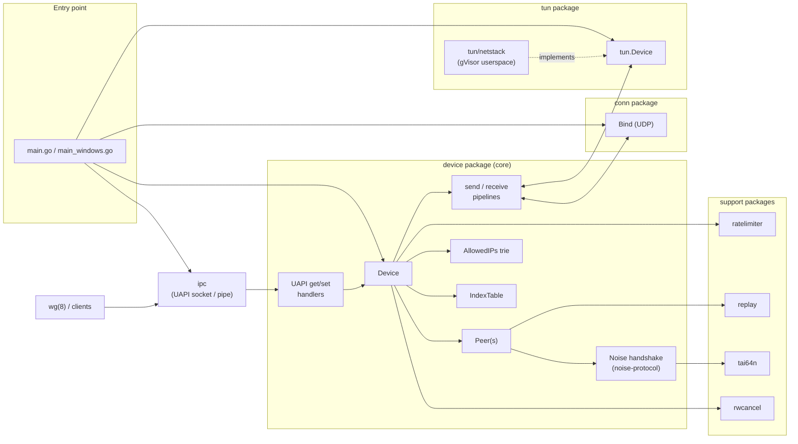
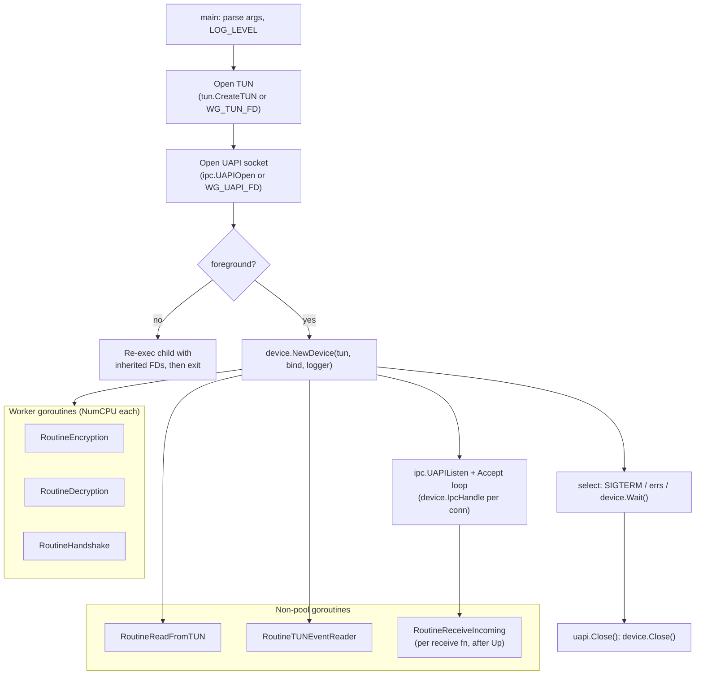
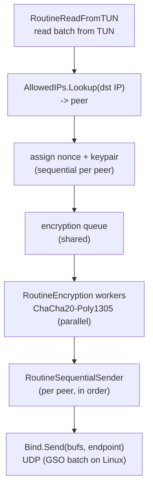
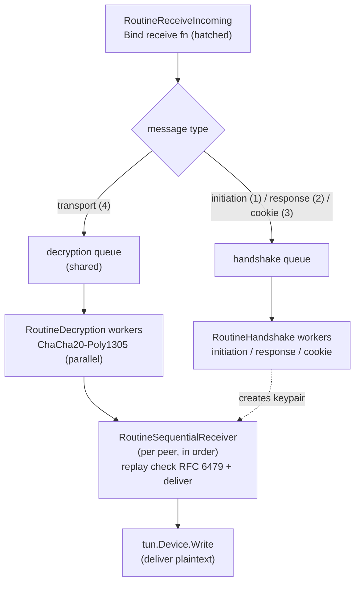
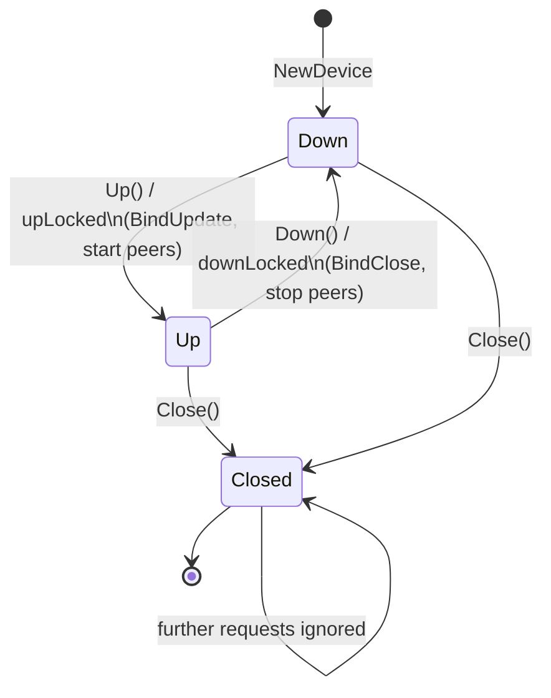
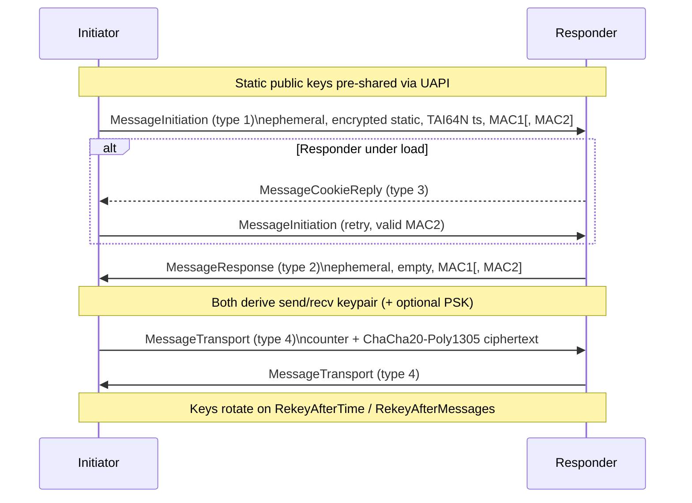
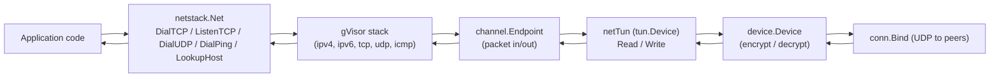
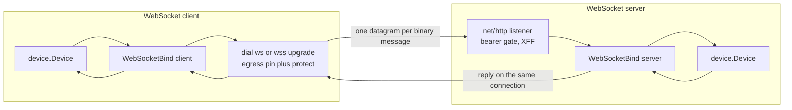

# wireguard-go — Architecture

This document describes how `wireguard-go` is structured and how packets, handshakes, and
configuration flow through it. Read `docs/PROJECT.md` first for the high-level overview, tech stack,
and configuration surfaces.

The design is a classic WireGuard userspace daemon: a **TUN device** on one side, a **UDP socket**
(the `conn.Bind`) on the other, and the **`device` package** in the middle running the Noise
handshake and the encrypt/decrypt transport pipelines. Configuration arrives out-of-band over the
**UAPI** control socket.

---

## 1. Component Overview

Everything is wired together by `device.NewDevice(tun.Device, conn.Bind, *Logger)`. The two
boundaries — `tun.Device` and `conn.Bind` — are small interfaces with per-OS implementations, which
is what makes the daemon portable and testable.

---

## 2. Process Startup & Goroutine Topology

`main` opens the TUN device and the UAPI socket (or adopts inherited file descriptors via
`WG_TUN_FD` / `WG_UAPI_FD`), optionally daemonizes, then constructs the `Device`. `NewDevice`
launches the worker pools; `BindUpdate` (triggered by `Up`) launches the UDP receive goroutines.

Per-peer, two additional goroutines preserve ordering: `RoutineSequentialSender` and
`RoutineSequentialReceiver`. They consume the parallel workers' output in the original packet order.

---

## 3. Outbound Data Path (plaintext → encrypted UDP)

Plaintext IP packets are read from the TUN device, routed to a peer by the allowed-IPs trie, given a
monotonically increasing nonce (sequential, per peer), encrypted in parallel by the worker pool, and
finally transmitted in original order by the peer's sequential sender.

If no keypair is available for the target peer, the packet triggers/awaits a handshake (see §6)
and is queued on the peer's staged-packet list until keys exist.

---

## 4. Inbound Data Path (encrypted UDP → plaintext)

UDP datagrams are received (batched), dispatched by message type. Transport messages are decrypted
in parallel and delivered to the TUN in order; handshake messages go to the handshake workers.

Under load (handshake queue filling up), `Device.IsUnderLoad` flips on and inbound handshake
initiations are gated by the per-source-IP `ratelimiter` and MAC2 cookie challenges.

---

## 5. Device State Machine

A `Device` is `down`, `up`, or `closed`. State is stored atomically and transitions are guarded by a
mutex (`changeState`). `closed` is terminal.

Bringing the device **up** opens the UDP bind (`BindUpdate`), starts route-listener cancellation
wiring, and starts each peer (sending keepalives where configured). Bringing it **down** closes the
bind and stops peers. `Close` additionally tears down the TUN, removes all peers, and drains the
worker queues before closing the `closed` channel that `main` waits on.

---

## 6. Noise IKpsk2 Handshake

The handshake follows the WireGuard protocol
(`Noise_IKpsk2_25519_ChaChaPoly_BLAKE2s`). The initiator sends a handshake initiation; the responder
replies; both derive a transport keypair. A TAI64N timestamp inside the initiation defends against
replays, and MAC1/MAC2 (with a cookie reply under load) authenticate and rate-limit.

Timers (`device/timers.go`) drive rekeying, persistent keepalives, and handshake retransmission per
the protocol constants in `device/constants.go` (e.g. `RekeyAfterTime`, `RejectAfterTime`,
`KeepaliveTimeout`).

---

## 7. Userspace Network Stack (`tun/netstack`)

`tun/netstack` provides an alternative `tun.Device` implementation backed by the gVisor TCP/IP
stack. Instead of handing plaintext packets to a kernel interface, it feeds them into an in-process
stack that offers Go-native `Dial*`/`Listen*` methods. This lets an application speak TCP/UDP/ICMP
*through* the WireGuard tunnel with no OS interface, no privileges, and no routing changes — the
basis for embedding WireGuard in a program.

The two extension points on the Roadmap (`docs/PROJECT.md`) live at **different** boundaries, and the
WireGuard core between them stays unchanged:

- The planned **WebSocket transport** plugs in at the **`conn.Bind`** boundary — it replaces UDP as
  the *outer* transport that carries the WireGuard wire protocol to peers. It is independent of this
  package.
- `tun/netstack` is the **`tun.Device`** boundary — the *inner* userspace stack used by embedded,
  no-kernel-interface clients (e.g. on macOS/Android).

An embedded client may use either boundary, both, or neither, since they compose independently.

---

## 8. Portability Boundaries

The only code that changes across operating systems lives behind two interfaces and a set of
build-tagged files:

- **`tun.Device`** — `tun_linux.go`, `tun_darwin.go`, `tun_windows.go`, `tun_freebsd.go`,
  `tun_openbsd.go`, plus `tun/netstack` for the userspace stack.
- **`conn.Bind`** — `bind_std.go` (portable), `bind_windows.go`, with per-OS control functions
  (`controlfns_*.go`), offload (`gso_*.go`, `features_*.go`), fwmark (`mark_*.go`), and sticky
  sockets (`sticky_*.go`).
- **`ipc` UAPI transport** — `uapi_linux.go`, `uapi_bsd.go`, `uapi_unix.go`, `uapi_windows.go`,
  `uapi_wasm.go`, and `ipc/namedpipe` on Windows.

Mobile builds additionally select queue sizing via `device/queueconstants_{android,ios,...}.go`
and adjust roaming via `device/mobilequirks.go`. Adding a platform or a transport means implementing
these interfaces, **not** touching the `device` core.

---

## 9. WebSocket Transport (`conn/ws_*.go`)

The WebSocket transport is an alternative `conn.Bind` (`conn.WebSocketBind`) that carries the
*unchanged* WireGuard datagrams over `ws(s)://` instead of UDP — one datagram per WebSocket binary
message. It is selected at startup with `WG_TRANSPORT=ws` and runs in one role per device
(`WG_WS_ROLE=client|server`). The `device` core is untouched: the additive UAPI keys reach it only via
the optional `conn.WebSocketBinder` interface it type-asserts, and network-switch roaming reuses the
existing `device.BindUpdate()` (close + reopen the bind), driven on the standalone daemon by a per-OS
path monitor (Linux netlink, macOS `NWPathMonitor` via cgo) and by the embedding app otherwise.

Key properties: a per-connection write mutex serialises concurrent senders; a never-closed inbound
queue plus a `done` channel and a joined `WaitGroup` give a race- and leak-free shutdown across
`BindUpdate` cycles; the client reconnects with DNS re-resolution and bounded per-endpoint backoff,
with WebSocket ping as a dead-connection backstop; the server rebinds a reconnecting peer via
`SetEndpointFromPacket` and gates upgrades with a constant-time bearer check. An optional Prometheus
collector (in `metrics/`) reads device peer atomics and WebSocket-bind counters through daemon-supplied
snapshots, so `metrics` imports neither `device` nor `conn`.
