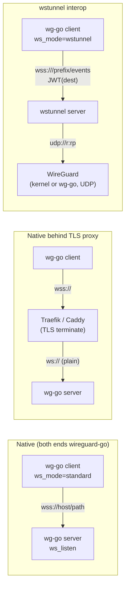
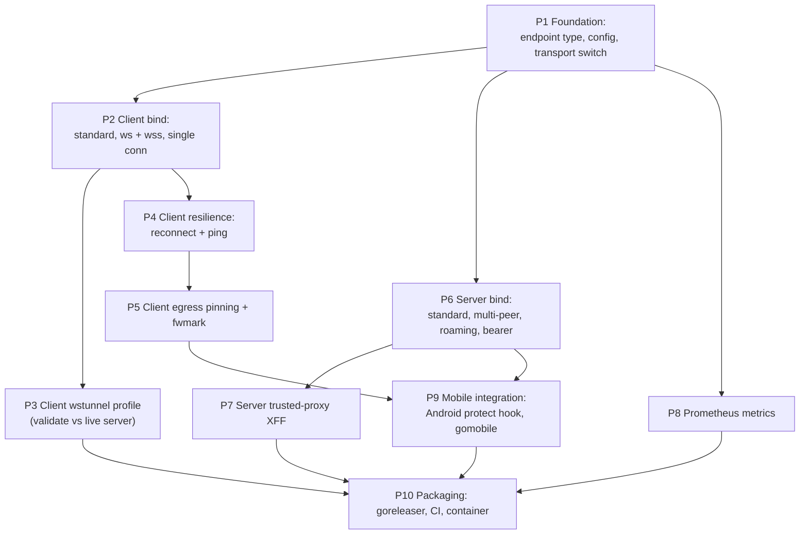

# WebSocket Transport — Work Plan

This document is the authoritative record of the decisions agreed for adding a **WebSocket transport**
to wireguard-go, plus the ordered engineering work to deliver it. It is a planning/decisions document,
not a `docs/plans/` pipeline plan. Read `docs/ARCHITECTURE.md` first for the existing transport seam
(`conn.Bind` / `conn.Endpoint`) that all of this builds on.

Every external fact below was verified this session against source or a live probe; anchors are given.
Items still to confirm are marked **⚠ TO VERIFY** and are non-blocking for the ordering.

---

## 1. Goal

Add a WebSocket outer transport so a wireguard-go endpoint can carry the WireGuard wire protocol over
`ws://` / `wss://` instead of UDP, in **both server and client roles**, usable:

1. **Natively** — a wireguard-go client and a wireguard-go server talking WS(S) to each other (directly
   or through a TLS-terminating reverse proxy such as Traefik/Caddy).
2. **Interop** — a wireguard-go client talking to an existing **wstunnel** server (proven working this
   session, see §2).

The delivery target is: the client transport can replace the Go backend inside the official
WireGuard macOS/Android apps, survives network switches (Wi-Fi ⇄ cellular), and exposes Prometheus
metrics — shipped as multi-platform binaries **and Docker images published to GitHub Container
Registry (ghcr.io)** via CI/CD.

---

## 2. Decisions (authoritative)

| # | Decision | Rationale / status |
|---|---|---|
| D1 | **Outer transport today is UDP-only**; WebSocket is a new, alternative outer transport. | Verified: `conn.Bind` opens `udp4`/`udp6` only ([conn/bind_std.go:159-165](conn/bind_std.go#L159-L165)); no TCP transport exists. |
| D2 | **One transport per device, chosen at startup: UDP _or_ WS(S).** No UDP+WS mux. | Agreed. Single `bind` per device ([device/device.go:43](device/device.go#L43)). |
| D3 | **HTTP/1.1 + WebSocket only. No HTTP/2.** | Proven: live server accepts `http/1.1` and completed a WS `101`. wstunnel's h2 is non-standard streaming (1 datagram = 1 h2 DATA frame), unsupported by our library and not cleanly expressible with Go's h2 API; useless for a single stream. |
| D4 | **Both server and client roles, first-class and symmetric.** The same WS URL is the server's listen address and the client's peer endpoint. | Agreed. |
| D5 | **`ws_mode = standard \| wstunnel`** selects the dialect bundle (path suffix, handshake header, destination encoding, framing quirks, future additions). | Agreed. `standard` = our native dialect; `wstunnel` = interop. |
| D6 | **Auth is orthogonal to mode**: optional pre-shared bearer, write-only/non-logged. `standard` → `Authorization: Bearer <token>`; `wstunnel` → optional basic-auth on top of the auto-JWT. WireGuard's Noise handshake remains the real authentication; the bearer is a coarse gate. | Agreed. |
| D7 | **Library: `github.com/coder/websocket` v1.8.15 on stdlib `net/http`.** | Latest verified (proxy.golang.org). h1 Upgrade + `http.Hijacker`; provides `Conn.Ping`. |
| D8 | **Framing: 1 WireGuard datagram = 1 WebSocket binary message.** No length prefix. | Matches wstunnel (`MAX_PACKET_LENGTH = 64 KiB`, `transport/io.rs`) and is native to WS. The `conn`-side read loop guards against a message exceeding the caller-provided receive-buffer length (the device sizes those buffers to `MaxMessageSize`, [device/constants.go:31](device/constants.go#L31)); the guard limit lives in `conn` (buffer length / a `conn` constant), NOT imported from `device` — `device` imports `conn` ([device/device.go:14](device/device.go#L14)), so the reverse would be an import cycle. |
| D9 | **Roaming = reconnect.** Server side: the endpoint wraps the live connection; a reconnecting client rebinds via `SetEndpointFromPacket`. Client side: reconnect + DNS re-resolve + re-upgrade. | Verified mechanism ([device/peer.go:279](device/peer.go#L279); receive death-spiral contract [device/receive.go:110-125](device/receive.go#L110-L125)). |
| D10 | **WS ping/pong** for dead-connection detection, proxy idle-timeout avoidance, and RTT metric. Configurable interval. | `coder/websocket` `Conn.Ping` verified. |
| D11 | **Egress pinning** re-applied on every dial to prevent the WS transport looping back into the tun: `IP_BOUND_IF`/`IPV6_BOUND_IF` (Darwin), `SO_MARK` + policy routing (Linux/Android), via `net.Dialer.Control`. | Verified constants: `IP_BOUND_IF=0x19`, `IPV6_BOUND_IF=0x7d` (x/sys@v0.32.0); `SO_MARK` path exists ([conn/mark_unix.go:19-27](conn/mark_unix.go#L19-L27)). |
| D12 | **"Works on network switch" = reconnect (D9) + ping detection (D10) + egress re-pinning (D11).** No wg-quick-style route-table management in the daemon; the OS/app owns the tun routes. | Agreed. |
| D13 | **Trusted-proxy source-IP** (opt-in): when explicitly configured as behind a trusted proxy, derive the endpoint IP from `X-Forwarded-For` so the handshake rate-limiter and MAC2 cookies stay per-client. Off by default; forged `XFF` ignored when not configured. | Agreed ("we need this properly"). Rate-limiter keys on `DstIP()` ([device/receive.go:336](device/receive.go#L336)); cookies on `DstToBytes()` ([device/receive.go:329](device/receive.go#L329)). |
| D14 | **No relay** (no simultaneous listen+dial) for now. A device **listens XOR dials**. | Agreed. Additive later; no interface/config break. Standard WireGuard does both on one UDP socket because UDP is connectionless; WS is connection-oriented so both-at-once is a distinct, deferred feature. |
| D15 | **Prometheus metrics**: `prometheus/client_golang` v1.24.1; own HTTP listener, **off by default**; scrape-time collector over existing peer atomics + WS-bind instrumentation; high-level + per-peer (`peer=<pubkey>`), including device-core rate-limit/handshake counters. | Latest verified. |
| D16 | **wstunnel interop is client-side and needs no shared secret.** | Proven: crafted a JWT with a **random** secret and got `101` from the live server; server uses `jsonwebtoken::dangerous::insecure_decode`. wstunnel latest = v10.6.2. |
| D17 | **Config split**: transport type, TLS material, metrics listener, trusted-proxy CIDRs, ping/backoff = **process-level** (env/flags, or embedder-supplied on mobile); `ws_listen`, per-peer `endpoint` URL, `ws_mode`, `ws_target`, `ws_bearer` = **UAPI** (additive keys). Endpoint strings may be URLs. `wg(8)`, the UAPI unknown-key rejection, and the Android app's `InetEndpoint` are patched **externally by the user** to allow URL endpoints. | Agreed. UAPI currently rejects unknown keys ([device/uapi.go:243](device/uapi.go#L243)). |
| D18 | **Delivery via goreleaser + GitHub Actions CI/CD.** goreleaser builds cross-platform **binaries** and multi-arch **Docker images**; images are **published to the user's GitHub Container Registry (`ghcr.io/danielealbano/wireguard-go`)**. **CI** runs the full quality-gate set on PRs/pushes; **CD** cuts a release (binaries + checksums + image push) on `v*` tags. The Android **AAR** is a separate gomobile CI job (not a goreleaser binary target). | Agreed. goreleaser v2.17.1; GitHub Actions. ghcr namespace `danielealbano` (confirmed via `gh api user`). |

### wstunnel wire contract (verified, for D5/D16)

- Path: `GET /<path-prefix>/events` (prefix defaults to the server certificate CN).
- Header: `Sec-WebSocket-Protocol: v1, authorization.bearer.<jwt>`.
- JWT claims (`transport/jwt.rs`): `{ id: <uuid>, p: <LocalProtocol>, r: <remote host>, rp: <remote port> }`;
  for UDP, `p = {"Udp":{"timeout":null}}`. Signed HS256 with an arbitrary secret (server does not verify).
- The wstunnel server opens a UDP socket to `r:rp` (the real WireGuard endpoint) and relays each WS
  binary message as one UDP datagram. **The WireGuard server behind wstunnel stays stock UDP.**

---

## 3. Topologies

---

## 4. Configuration surface

Placement per D17. Exact home of a few items (ping interval, per-role TLS) is a finalization detail,
not a blocker.

| Key | Where | Role | Meaning |
|---|---|---|---|
| `WG_TRANSPORT=udp\|ws` | process (env/flag) | both | Selects the bind at startup. Default `udp`. |
| `ws_listen = ws(s)://host:port/path` | UAPI device | server | Start a WS listener at this address/path. |
| `endpoint = ws(s)://host:port/path` | UAPI peer | client | Dial this to reach the peer. In `wstunnel` mode this is the **wstunnel server** URL; the real WireGuard target is `ws_target`. |
| `ws_mode = standard\|wstunnel` | UAPI peer | client | Dialect bundle (D5). Client-side only — a wireguard-go server is always `standard` (D16). |
| `ws_target = host:port` | UAPI peer | client | **(`wstunnel` mode only)** the real WireGuard endpoint the wstunnel server forwards UDP to — encoded as the JWT `r`/`rp` (D16). Absent/ignored in `standard` mode. |
| `ws_bearer = <token>` | UAPI peer (write-only, not echoed) | both | Optional pre-shared bearer (D6). MUST NOT be emitted by `IpcGetOperation` — note `private_key`/`preshared_key` **are** echoed today ([device/uapi.go:89,104](device/uapi.go#L89)), so `ws_bearer` needs the opposite handling. |
| TLS: server `cert`/`key`; client `ca`/`servername`/`insecure` | process (files/flags) | both | `wss` material. Never over UAPI. |
| `ws_ping_interval`, reconnect backoff | process | client | D10. Sane defaults. |
| trusted-proxy CIDR(s) | process | server | D13. Empty ⇒ `XFF` ignored. |
| metrics listen address | process | both | D15. Empty ⇒ metrics **off**. |

Secrets (`ws_bearer`, TLS private key) MUST NEVER appear in logs or `IpcGetOperation` output.

---

## 5. Work — in order

Each phase is independently testable and builds on the prior. Automated tests use stdlib `testing`
with `net/http/httptest` fakes and the race detector; **no live network** in automated tests. Testing
against the live wstunnel server is documented **Manual QA**.

### P1 — Foundation: endpoint type, config plumbing, transport switch
- **Depends on:** none.
- **Changes:**
  - `conn/ws_endpoint.go` (new): `WSEndpoint` implementing `conn.Endpoint` — carries the target URL and,
    in server role, a reference/id for the live connection; `DstIP`/`DstToBytes` derive from the remote
    TCP address (or `XFF` per D13); `DstToString` round-trips the URL.
  - `conn/ws_config.go` (new): typed WS config + functional options (per `go.md`).
  - `conn/ws_bind.go` (new): `WebSocketBind` skeleton implementing `conn.Bind` (Open/Close/Send/
    ParseEndpoint/SetMark/BatchSize); `ParseEndpoint` accepts `ws(s)://` URLs. `BatchSize` = 1 initially.
  - `conn/default.go` / `main.go`: startup transport switch on `WG_TRANSPORT`; UDP remains default.
  - `device/uapi.go`: accept the additive keys from §4 (device: `ws_listen`; peer: `ws_mode`,
    `ws_target`, `ws_bearer` write-only, URL `endpoint`); keep unknown-key rejection for everything else.
  - `go.mod`: add `github.com/coder/websocket`; `go mod tidy`; `govulncheck`.
- **Tests:** endpoint parse/round-trip (`ws`/`wss`, path, port); UAPI additive-key parse + `ws_bearer`
  not echoed by `IpcGet`; transport selection.
- **Done when:** device builds and runs with `WG_TRANSPORT=ws` selecting the (not-yet-functional) WS
  bind; config round-trips; all platforms compile.

### P2 — Client bind: standard mode, single connection (`ws://` then `wss://`)
- **Depends on:** P1.
- **Changes:**
  - `conn/ws_client.go` (new): dial via `coder/websocket` + `net/http`; upgrade at the URL path; one
    long-lived connection per peer endpoint, dialed on demand (first `Send`/handshake). Per-connection
    **write mutex** (concurrent senders: [device/send.go](device/send.go), keepalive, cookie). Read loop
    turns each binary message into a datagram delivered through the shared inbound queue that `Open`'s
    `ReceiveFunc`(s) drain. Honor the receive error contract (return `net.ErrClosed` after `Close`).
  - `conn/ws_dialect.go` (new): `standard` dialect (verbatim path, optional `Authorization: Bearer`).
  - TLS for `wss` (client): system roots by default; `ca`/`servername`/`insecure` options.
- **Tests:** loopback `httptest` WS and TLS servers; two devices complete a handshake and exchange data
  (mirror `conn/bindtest` + `device` tests); oversize-message rejection; `Close` unblocks receivers.
- **Done when:** two wireguard-go instances tunnel over `ws://` and `wss://` on loopback, race-clean.

### P3 — Client wstunnel profile (interop)
- **Depends on:** P2.
- **Changes:** `conn/ws_dialect.go`: `wstunnel` dialect — path `/<prefix>/events`, JWT builder
  (`id`,`p:Udp`,`r`,`rp`), `Sec-WebSocket-Protocol: v1, authorization.bearer.<jwt>`, optional basic-auth.
  Destination (`r:rp`) sourced from the `ws_target` peer key (§4) — the real WireGuard endpoint the
  wstunnel server forwards to; the peer `endpoint` URL is the wstunnel server itself.
- **Tests:** unit-assert the upgrade request (method, path, subprotocol header, JWT claim JSON) matches
  the verified wstunnel contract (§2). **Manual QA:** connect through the live wstunnel server.
- **Done when:** the generated handshake is byte-shape-correct; Manual QA reaches `101` and tunnels.

### P4 — Client resilience: reconnect + ping
- **Depends on:** P2.
- **Changes:** reconnect loop (detect drop, re-dial, **re-resolve DNS**, re-upgrade, resume) that
  swallows transient failures and surfaces `net.ErrClosed` only on real `Close`; WS ping ticker
  (`Conn.Ping`, configurable) for dead-connection detection + RTT capture; bounded backoff.
- **Tests:** simulated server drop → client reconnects and resumes; ping-timeout triggers reconnect;
  no goroutine leak across reconnects (race + leak check).
- **Done when:** tunnel survives forced disconnects/DNS changes without device restart.

### P5 — Client egress pinning + `SetMark`
- **Depends on:** P4.
- **Changes:**
  - `conn/ws_pinning_darwin.go` / `_linux.go` / `_default.go` (build-tagged): `net.Dialer.Control`
    binding the dial to the physical egress interface — `IP_BOUND_IF`/`IPV6_BOUND_IF` (Darwin),
    `SO_MARK` (+ documented policy-routing expectation) on Linux/Android; recomputed on every redial.
  - Implement `WebSocketBind.SetMark` (applies to the dialer/sockets).
  - Physical-interface detection + re-detection on network change.
- **Tests:** unit-test control-hook selection per platform and that redial recomputes pinning; interface
  detection logic with injected state. (Real pinning is a Manual QA item on-device.)
- **Done when:** on a host whose default route is the tun, the WS transport still egresses via the
  physical link and re-pins after a network switch.

### P6 — Server bind: standard mode, multi-peer
- **Depends on:** P1.
- **Changes:**
  - `conn/ws_server.go` (new): `net/http` server on `ws_listen` (`ws`/`wss` with `cert`/`key`); handler
    at `/path` validating the bearer (D6) else `401`; each accepted connection = one peer's transport
    with its own read loop feeding the shared inbound queue; `Send` dispatches to the connection named by
    the endpoint; **roaming** rebinds a peer to a new connection on reconnect via `SetEndpointFromPacket`.
    `Open` returns a fixed small set of `ReceiveFunc`s draining the shared queue.
- **Tests:** multiple concurrent clients; bearer accept/reject; a client reconnecting rebinds and traffic
  resumes; `DstIP`/`DstToBytes` from the connection's remote addr feed rate-limiter/cookies.
- **Done when:** one wireguard-go server serves multiple WS clients, race-clean, with roaming.

### P7 — Server trusted-proxy `X-Forwarded-For`
- **Depends on:** P6.
- **Changes:** when the remote addr is a configured trusted-proxy CIDR, take the endpoint IP from
  `XFF`; otherwise ignore `XFF` entirely. Feeds rate-limiter + cookie identity (D13).
- **Tests:** `XFF` honored only from trusted sources; forged `XFF` from untrusted source ignored;
  per-client rate-limiter isolation restored behind a proxy.
- **Done when:** behind a configured proxy, handshake rate-limiting/cookies are per-client, not collapsed.

### P8 — Prometheus metrics
- **Depends on:** P1 for the collector, HTTP listener, and device-core + peer-atomic metrics. The
  WS-specific metrics (connections, reconnects, ping RTT) consume surfaces introduced by P2/P4/P6 —
  which precede P8 in the order — instrumented in those phases and exposed by this collector.
- **Changes:**
  - `metrics/` (new): a `prometheus.Collector` consuming a small **consumer-defined interface** for
    device peer stats (add a read-only peer-iteration accessor to `device` exposing the existing
    `txBytes`/`rxBytes`/`lastHandshakeNano` atomics — [device/peer.go:24-26](device/peer.go#L24-L26)) plus
    WS-bind counters; its own HTTP listener, **off unless configured**.
  - Device-core counters (handshake rate-limited/failed) require small hooks at
    [device/receive.go:336](device/receive.go#L336) and the handshake paths.
  - `go.mod`: add `github.com/prometheus/client_golang`; tidy; `govulncheck`.
- **Metric set:** high-level (`wireguard_info`, `wireguard_peers`, `wireguard_ws_connections_active`,
  `wireguard_ws_connections_total{result}`, `wireguard_ws_reconnects_total`, rx/tx messages+bytes,
  `wireguard_ws_dropped_messages_total{reason}`, `wireguard_ws_ping_rtt_seconds`,
  `wireguard_handshake_rate_limited_total`, `wireguard_handshakes_total{result=completed\|failed}`);
  per-peer `peer=<pubkey>`
  (`wireguard_peer_{tx,rx}_bytes_total`, `wireguard_peer_last_handshake_timestamp_seconds`,
  `wireguard_peer_connected`, `wireguard_peer_reconnects_total`, `wireguard_peer_ping_rtt_seconds`).
- **Tests:** collector output vs seeded state; listener absent when unconfigured; label cardinality bounded.
- **Done when:** metrics scrape at both levels; default build exposes nothing until configured.

### P9 — Mobile integration (Android protect hook, gomobile)
- **Depends on:** P5, P6.
- **Changes (this repo):** the existing Android hook `PeekLookAtSocketFd4/6`
  ([conn/conn.go:69-72](conn/conn.go#L69-L72)) exposes one fd per family — insufficient for
  per-connection TCP dials. Add a **dial-time protect callback** (functional option on the WS bind,
  invoked in `net.Dialer.Control`) so the embedding app can `VpnService.protect` each WS socket;
  the WS bind must NOT implement `PeekLookAtSocketFd`. Verify gomobile-compatible build. macOS reuses
  P5 pinning. The full layer-by-layer change list (this repo + libwg-go + app) is in
  **`docs/ANDROID_INTEGRATION.md`**; app/libwg-go patches are **external** (user-owned).
- **Tests:** the protect callback is invoked for every dial with the socket fd; build succeeds for the
  mobile build tags/targets.
- **Done when:** the WS client bind builds for Android/iOS/macOS targets and every dial is protectable.

### P10 — Packaging & delivery (goreleaser, Docker/ghcr, CI/CD)
- **Depends on:** P3, P7, P8, P9.
- **Changes:**
  - `.goreleaser.yaml` (new): cross-compiled **binaries** for linux/darwin/windows/freebsd/openbsd across
    amd64/arm64 (+ arm where relevant), with archives and checksums.
  - **Docker images** (new `Dockerfile`, multi-stage, distroless/scratch, nonroot): multi-arch
    (amd64/arm64) built by goreleaser and **pushed to `ghcr.io/danielealbano/wireguard-go`** on `v*` tags
    (goreleaser `dockers` + `docker_manifests`).
  - **Android AAR** via a separate **gomobile** CI job (from P9), attached as a release asset — this is
    NOT a goreleaser binary target.
  - `.github/workflows/ci.yml` (new): **CI** on PRs/pushes — build, `go vet`, `golangci-lint`, race
    tests, `go mod tidy` diff-check, `govulncheck`, and `mermaid-check`.
  - `.github/workflows/release.yml` (new): **CD** on `v*` tags — `ghcr.io` login via `GITHUB_TOKEN`,
    goreleaser release (binaries + checksums + image push + manifest) and AAR upload.
  - Makefile `snapshot`/`release` targets aligned to `.claude/rules/project.md`.
- **Tests:** CI green on the full gate set; `goreleaser release --snapshot --clean` produces binaries +
  a local multi-arch image; the built image runs `wireguard-go --version`.
- **Done when:** tagging `vX.Y.Z` publishes binaries + checksums, a multi-arch image to the user's ghcr,
  and the Android AAR; CI gates enforce the quality bar on every PR/push.

---

## 6. Invariants to preserve (every phase)

- **Wire protocol is sacred** — no change to the Noise handshake, message types/sizes, or transport
  header. WS carries the *existing* datagrams unchanged.
- **Single bind per device**; portability stays behind `conn.Bind`/`conn.Endpoint`/`ipc` — no
  OS-specific or transport-specific logic in the `device` core.
- **Ordering & locking**: parallel crypto workers + per-peer sequential send/receive are unchanged; run
  all tests with `-race`.
- **No secrets in logs**: `ws_bearer`, TLS private keys, and any key material never logged or echoed.
- **Cross-platform builds** (linux, darwin, windows, freebsd, openbsd + mobile) MUST keep compiling;
  build-tag every OS-specific file.
- **Quality gates** (`go.md` §4) before any phase is "done": build, `go vet`, `golangci-lint`, race
  tests, `go mod tidy` clean, and Mermaid validation when charts change.

---

## 7. Open items to confirm (non-blocking)

- **⚠ TO VERIFY** — what source IP the user's wstunnel server presents to the WireGuard server (whether
  `XFF`/D13 is even relevant in that specific topology). Trace through wstunnel server source or observe.
- Android `VpnService.protect` per-dial callback: mechanism documented in
  `docs/ANDROID_INTEGRATION.md` (verified against the `../wireguard-android` checkout); remaining
  JNI signature/lifecycle details tracked there.
- **⚠ TO VERIFY** — macOS/iOS network-change signal to trigger fast re-pin/reconnect
  (`nw_path_monitor` vs. polling) — a P5 refinement; ping-based detection is the baseline.
- **⚠ TO VERIFY** — `coder/websocket` client masking vs. any wstunnel expectation (RFC 6455 client
  masking is on by default; wstunnel servers accept masked frames — low risk).

---

## 8. Out of scope (unless later requested)

- HTTP/2 / WebTransport transports (D3).
- Simultaneous listen + dial / relay (D14).
- UDP+WS mux on one device (D2).
- Daemon-side route-table management (D12) — the OS/app owns tun routes.
- App-side patches to `wg(8)`, the UAPI unknown-key policy, and the Android app config model — owned
  externally by the user (D17).
